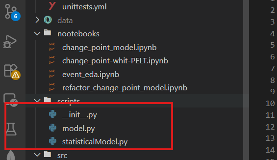
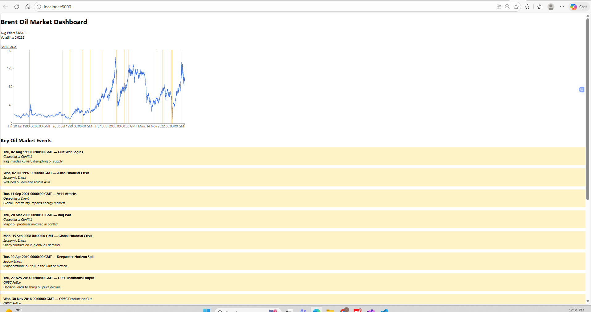
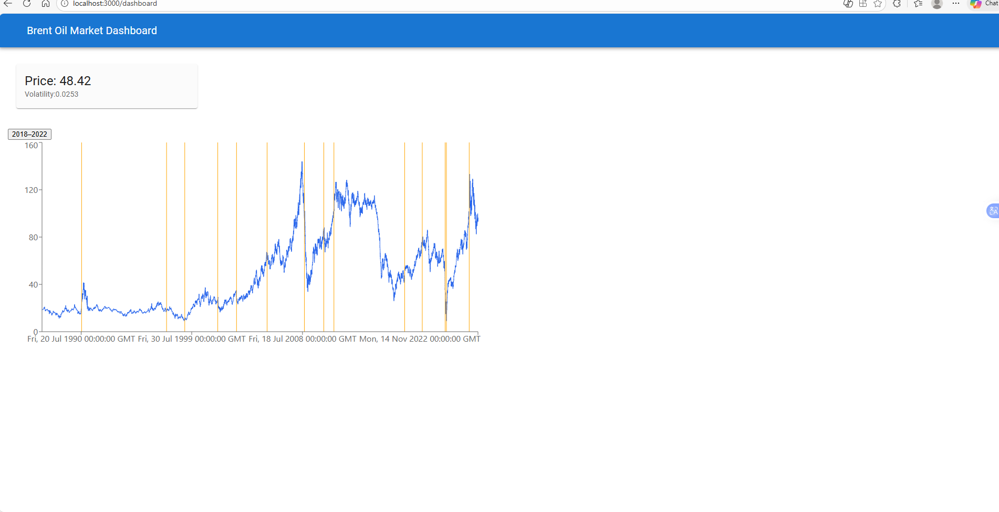
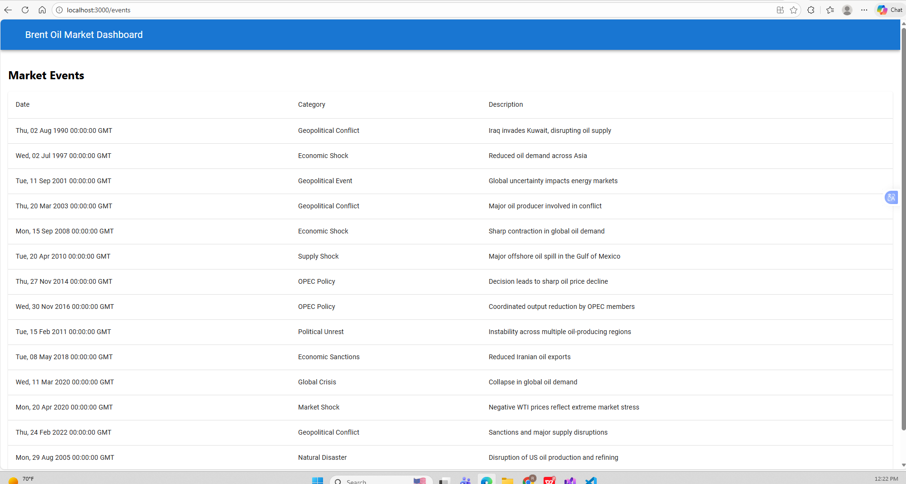
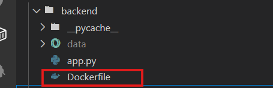
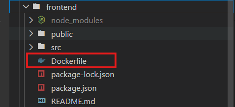
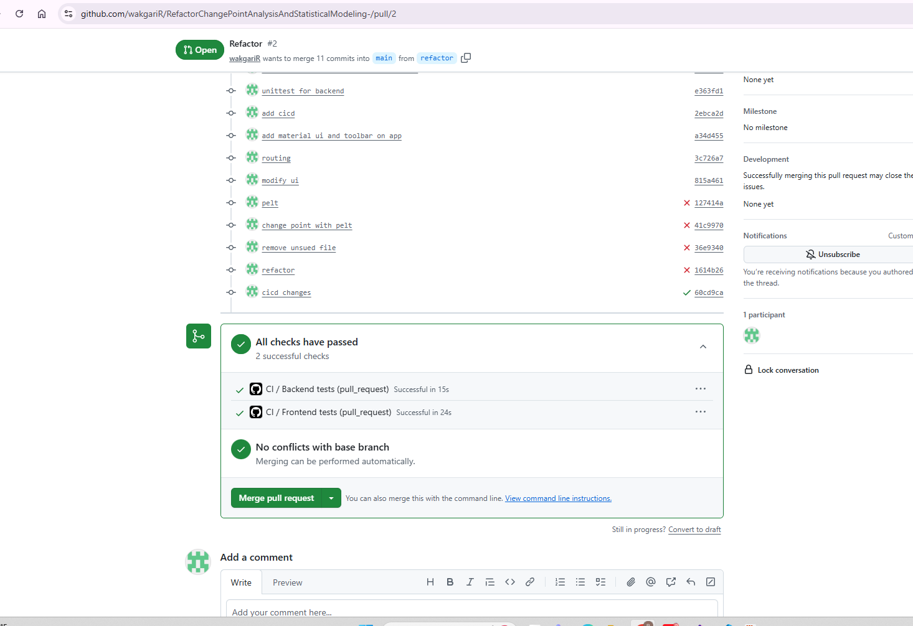
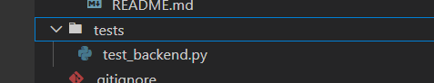

# ChangePointAnalysisAndStatisticalModeling

## Refactor the code to make reusable

## Previuos UI

## New change on Dashboard

i added two routing one for dashboard and the second one is for event list and add material ui to refactor the reac
ui, to access the dashboard use /dashboard and to see the event use /events

## Docker file added for both frontend and backend

## Github cicd added and used before merge my pr

## Unittest added and used on cicd

